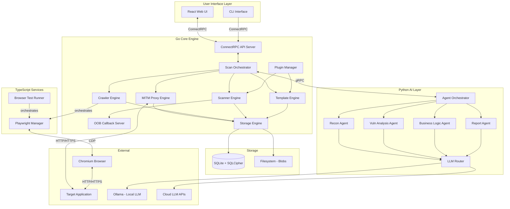
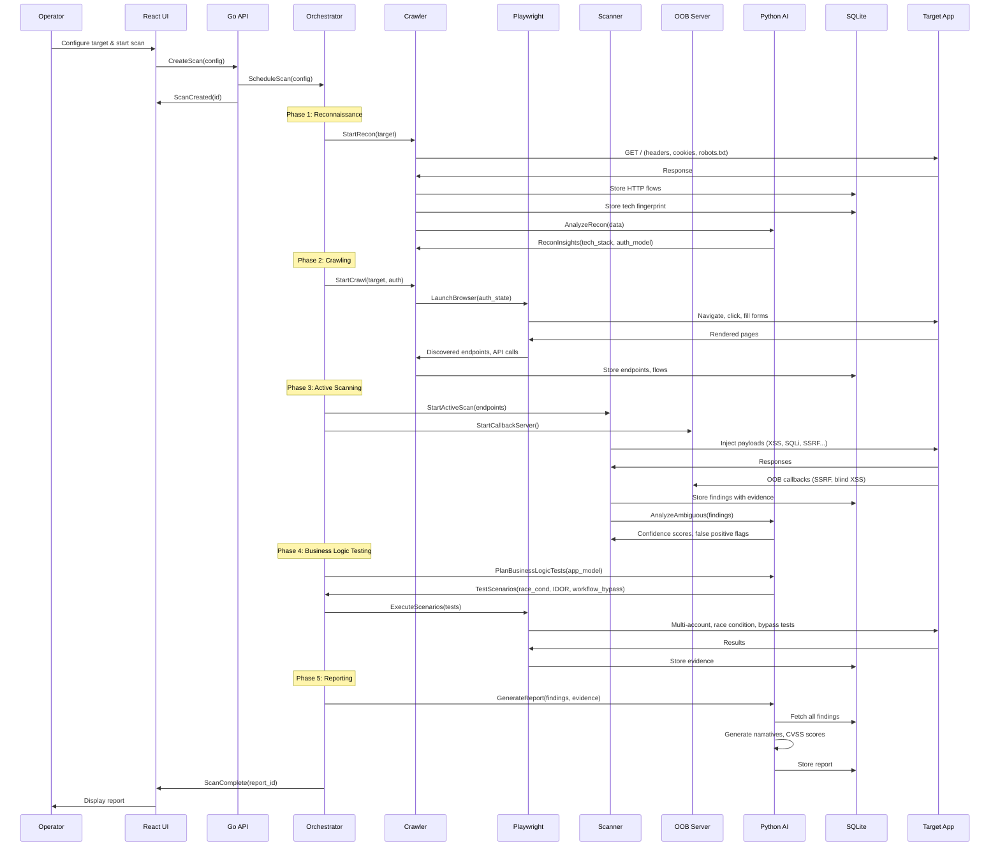
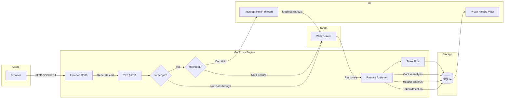
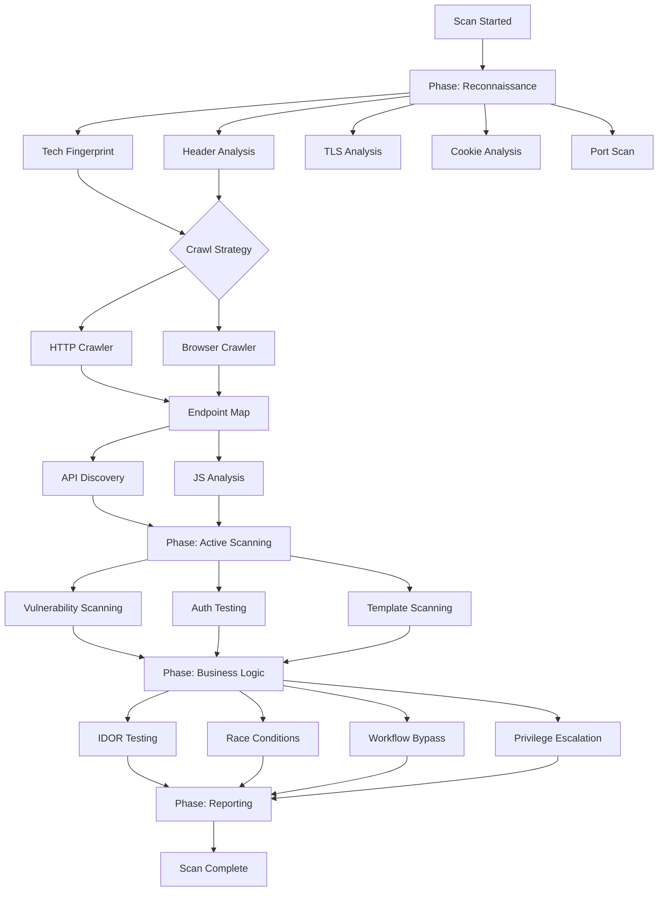
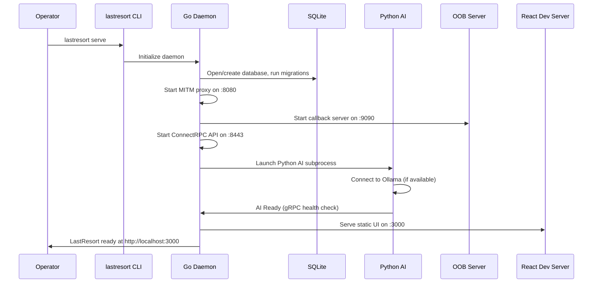

# System Architecture

> **Purpose:** High-level and detailed component architecture for LastResort.
> Includes data flow, scan orchestration, and component interaction diagrams.

---

## 1. High-Level Architecture



---

## 2. Component Architecture

### 2.1 Go Core Engine

The Go core is the heart of the system — a single binary that runs as a daemon process.

```
cmd/lastresort/
├── main.go              # Entry point, CLI parsing, daemon startup
├── serve.go             # Start API server, proxy, OOB
└── scan.go              # CLI scan commands

internal/
├── api/                 # ConnectRPC API server
│   ├── server.go        # gRPC server setup, middleware
│   ├── scan_service.go  # Scan CRUD, control (start/stop/pause)
│   ├── proxy_service.go # Proxy history, intercept control
│   ├── finding_service.go # Finding CRUD, filtering
│   ├── project_service.go # Project management
│   ├── report_service.go  # Report generation triggers
│   └── stream_service.go  # Real-time event streaming
│
├── proxy/               # MITM Proxy Engine
│   ├── proxy.go         # Core proxy server (goproxy-based)
│   ├── interceptor.go   # Request/response interception hooks
│   ├── tls.go           # Custom CA cert generation, TLS MITM
│   ├── websocket.go     # WebSocket interception
│   ├── scope.go         # In-scope/out-of-scope filtering
│   └── passive.go       # Passive analysis on all proxied traffic
│
├── crawler/             # Crawler Engine
│   ├── crawler.go       # Orchestrates crawl sessions
│   ├── http_crawler.go  # Traditional HTTP link-following crawler
│   ├── browser_crawler.go # Playwright-based SPA crawler (delegates to TS)
│   ├── api_discovery.go # REST/GraphQL/WebSocket endpoint discovery
│   ├── js_analyzer.go   # JavaScript bundle analysis for hidden endpoints
│   └── sitemap.go       # Sitemap/robots.txt parsing
│
├── scanner/             # Scanner Engine
│   ├── scanner.go       # Scan session manager
│   ├── insertion.go     # Insertion point detection (params, headers, cookies, body)
│   ├── xss.go           # XSS testing (reflected, stored, DOM hooks)
│   ├── sqli.go          # SQL injection testing (6 techniques, inspired by sqlmap)
│   ├── csrf.go          # CSRF validation
│   ├── ssrf.go          # SSRF testing with OOB callbacks
│   ├── idor.go          # IDOR testing (multi-account comparison)
│   ├── auth_test.go     # Authentication testing (JWT, session, OAuth)
│   ├── ratelimit.go     # Rate limit validation
│   ├── headers.go       # Security header validation
│   ├── cors.go          # CORS misconfiguration testing
│   ├── upload.go        # File upload testing
│   ├── smuggling.go     # HTTP request smuggling (CL.TE, TE.CL)
│   ├── ssti.go          # Server-Side Template Injection
│   ├── race.go          # Race condition testing (single-packet attacks)
│   └── miscconfig.go    # Security misconfiguration detection
│
├── orchestrator/        # Scan Orchestration
│   ├── orchestrator.go  # DAG-based phase management
│   ├── dag.go           # Task dependency graph
│   ├── scheduler.go     # Task scheduling and worker pool management
│   ├── throttle.go      # Target-aware rate limiting and throttling
│   ├── phase.go         # Scan phase definitions (recon, crawl, scan, report)
│   └── events.go        # Event bus for inter-component communication
│
├── template/            # Template Engine
│   ├── engine.go        # YAML template parser and executor
│   ├── parser.go        # Template YAML parsing
│   ├── matcher.go       # Response matching (word, regex, status, binary, DSL)
│   ├── extractor.go     # Data extraction from responses
│   ├── variables.go     # Variable substitution and payload management
│   ├── clustering.go    # Request clustering optimization (Nuclei-inspired)
│   └── auth.go          # Authentication-aware template execution
│
├── oob/                 # Out-of-Band Callback Server
│   ├── server.go        # HTTP/DNS callback listener
│   ├── dns.go           # DNS callback handler
│   ├── http.go          # HTTP callback handler
│   ├── correlator.go    # Correlate callbacks to scan requests
│   └── payloads.go      # OOB payload generation
│
├── storage/             # Storage Engine
│   ├── db.go            # SQLite connection, migrations, WAL mode
│   ├── migrations/      # Schema migration files
│   ├── flows.go         # HTTP flow CRUD
│   ├── findings.go      # Finding CRUD
│   ├── projects.go      # Project CRUD
│   ├── sessions.go      # Scan session CRUD
│   ├── search.go        # FTS5 full-text search
│   └── blob.go          # Large blob filesystem storage
│
├── plugin/              # Plugin Manager
│   ├── manager.go       # Plugin discovery, loading, lifecycle
│   ├── template.go      # YAML template plugin loader
│   ├── script.go        # Lua/JS script engine
│   ├── grpc.go          # gRPC plugin client
│   └── sandbox.go       # Plugin sandboxing and resource limits
│
└── config/              # Configuration
    ├── config.go        # App configuration struct
    └── defaults.go      # Default configuration values
```

### 2.2 TypeScript UI + Browser Automation

```
ui/
├── src/
│   ├── App.tsx                    # Root application
│   ├── main.tsx                   # Entry point
│   │
│   ├── api/                       # Generated ConnectRPC clients
│   │   ├── scan_connect.ts
│   │   ├── proxy_connect.ts
│   │   ├── finding_connect.ts
│   │   └── report_connect.ts
│   │
│   ├── components/
│   │   ├── layout/
│   │   │   ├── Sidebar.tsx
│   │   │   ├── Header.tsx
│   │   │   └── MainLayout.tsx
│   │   ├── dashboard/
│   │   │   ├── Dashboard.tsx
│   │   │   ├── ScanProgress.tsx
│   │   │   ├── FindingSummary.tsx
│   │   │   └── SystemHealth.tsx
│   │   ├── proxy/
│   │   │   ├── ProxyHistory.tsx     # Like Burp Proxy History
│   │   │   ├── RequestViewer.tsx
│   │   │   ├── ResponseViewer.tsx
│   │   │   └── InterceptToggle.tsx
│   │   ├── editor/
│   │   │   ├── HttpEditor.tsx       # Like Burp Repeater
│   │   │   ├── RequestBuilder.tsx
│   │   │   └── ResponseAnalyzer.tsx
│   │   ├── scan/
│   │   │   ├── ScanConfig.tsx
│   │   │   ├── ScanControl.tsx
│   │   │   └── ScanPhaseView.tsx
│   │   ├── findings/
│   │   │   ├── FindingsList.tsx
│   │   │   ├── FindingDetail.tsx
│   │   │   ├── SeverityBadge.tsx
│   │   │   └── EvidenceViewer.tsx
│   │   ├── ai/
│   │   │   ├── AiConsole.tsx        # AI activity log
│   │   │   ├── HypothesisCard.tsx
│   │   │   └── HumanReview.tsx
│   │   └── reports/
│   │       ├── ReportConfig.tsx
│   │       └── ReportPreview.tsx
│   │
│   ├── hooks/
│   │   ├── useStream.ts           # Real-time event streaming
│   │   ├── useScan.ts
│   │   └── useFindings.ts
│   │
│   ├── stores/
│   │   ├── scanStore.ts           # Zustand store for scan state
│   │   ├── proxyStore.ts
│   │   └── settingsStore.ts
│   │
│   └── styles/
│       ├── globals.css
│       ├── theme.ts
│       └── components/

browser/                            # Browser automation (separate from UI)
├── src/
│   ├── manager.ts                  # Playwright instance management
│   ├── crawler.ts                  # SPA-aware browser crawling
│   ├── auth.ts                     # Authentication flow automation
│   ├── capture.ts                  # Network capture via CDP
│   ├── dom_analyzer.ts             # DOM XSS detection
│   ├── interaction.ts              # Form filling, button clicking
│   ├── screenshot.ts               # Evidence capture
│   └── grpc_bridge.ts             # Communication with Go core
```

### 2.3 Python AI Layer

```
ai/
├── src/
│   ├── __init__.py
│   ├── server.py                   # gRPC server for Go communication
│   │
│   ├── agents/
│   │   ├── __init__.py
│   │   ├── orchestrator.py         # Master planning agent
│   │   ├── recon_agent.py          # Reconnaissance analysis
│   │   ├── vuln_agent.py           # Vulnerability analysis
│   │   ├── business_logic.py       # Business logic testing agent
│   │   └── report_agent.py         # Report generation agent
│   │
│   ├── llm/
│   │   ├── __init__.py
│   │   ├── router.py               # Model routing (local vs cloud)
│   │   ├── ollama_client.py        # Ollama integration
│   │   ├── openai_client.py        # OpenAI API client
│   │   ├── anthropic_client.py     # Anthropic API client
│   │   ├── budget.py               # Token budget management
│   │   └── prompts/                # Prompt templates
│   │       ├── recon.py
│   │       ├── vuln_analysis.py
│   │       ├── business_logic.py
│   │       └── report.py
│   │
│   ├── report/
│   │   ├── __init__.py
│   │   ├── generator.py            # Report orchestration
│   │   ├── templates/              # Jinja2 report templates
│   │   ├── pdf.py                  # PDF rendering (WeasyPrint)
│   │   └── cvss.py                 # CVSS calculator
│   │
│   └── utils/
│       ├── __init__.py
│       └── logging.py
│
├── tests/
├── pyproject.toml
└── requirements.txt
```

---

## 3. Data Flow Architecture

### 3.1 Scan Execution Flow



### 3.2 Proxy Traffic Flow



---

## 4. Scan Orchestration Architecture

### 4.1 DAG-Based Phase Management



### 4.2 Worker Pool Architecture

```
Orchestrator
├── Phase Manager
│   ├── Phase: Recon
│   │   └── Worker Pool (5 workers)
│   │       ├── Worker 1: Tech fingerprint
│   │       ├── Worker 2: Header analysis
│   │       ├── Worker 3: TLS check
│   │       ├── Worker 4: Cookie analysis
│   │       └── Worker 5: Port scan
│   │
│   ├── Phase: Crawl
│   │   └── Worker Pool (10 workers)
│   │       ├── Workers 1-5: HTTP crawling
│   │       └── Workers 6-10: Browser crawling (Playwright)
│   │
│   ├── Phase: Active Scan
│   │   └── Worker Pool (50 workers)
│   │       ├── Workers 1-20: Vulnerability payloads
│   │       ├── Workers 21-30: Template execution
│   │       └── Workers 31-50: Fuzzing
│   │
│   └── Phase: Business Logic
│       └── Worker Pool (5 workers)
│           ├── Worker 1-2: AI-guided scenario execution
│           └── Worker 3-5: Browser-based testing
│
├── Rate Limiter
│   ├── Per-target token bucket
│   ├── Global rate limit
│   ├── Adaptive throttling (monitor target response times)
│   └── Circuit breaker (stop if target unresponsive)
│
├── Event Bus
│   ├── scan.phase.started
│   ├── scan.phase.completed
│   ├── scan.finding.new
│   ├── scan.progress.update
│   └── scan.error
│
└── State Manager
    ├── Scan status (queued/running/paused/completed/failed)
    ├── Phase status per phase
    ├── Worker status per worker
    └── Findings count per severity
```

---

## 5. Communication Architecture

### 5.1 ConnectRPC API (Go ↔ TypeScript)

```protobuf
// proto/scan/v1/scan.proto

syntax = "proto3";
package scan.v1;

service ScanService {
  // CRUD
  rpc CreateScan(CreateScanRequest) returns (CreateScanResponse);
  rpc GetScan(GetScanRequest) returns (GetScanResponse);
  rpc ListScans(ListScansRequest) returns (ListScansResponse);
  
  // Control
  rpc StartScan(StartScanRequest) returns (StartScanResponse);
  rpc PauseScan(PauseScanRequest) returns (PauseScanResponse);
  rpc StopScan(StopScanRequest) returns (StopScanResponse);
  
  // Streaming
  rpc StreamScanEvents(StreamScanEventsRequest) returns (stream ScanEvent);
  rpc StreamProxyTraffic(StreamProxyTrafficRequest) returns (stream HttpFlow);
}

message ScanConfig {
  string target_url = 1;
  repeated string scope_patterns = 2;
  ScanProfile profile = 3;
  AuthConfig auth = 4;
  ThrottleConfig throttle = 5;
  repeated string enabled_modules = 6;
  AiConfig ai = 7;
}

message ScanEvent {
  string scan_id = 1;
  string event_type = 2;  // phase.started, finding.new, progress.update
  google.protobuf.Timestamp timestamp = 3;
  google.protobuf.Struct data = 4;
}

enum ScanProfile {
  SCAN_PROFILE_UNSPECIFIED = 0;
  SCAN_PROFILE_QUICK = 1;      // Recon + passive only
  SCAN_PROFILE_STANDARD = 2;   // Recon + crawl + active scan
  SCAN_PROFILE_DEEP = 3;       // All phases including business logic
  SCAN_PROFILE_API_ONLY = 4;   // API-focused testing
  SCAN_PROFILE_AUTH_ONLY = 5;  // Authentication/authorization focus
}
```

### 5.2 gRPC API (Go ↔ Python AI)

```protobuf
// proto/ai/v1/ai.proto

syntax = "proto3";
package ai.v1;

service AiService {
  // Analysis
  rpc AnalyzeRecon(AnalyzeReconRequest) returns (ReconInsights);
  rpc GenerateHypotheses(HypothesisRequest) returns (stream Hypothesis);
  rpc AnalyzeFindings(AnalyzeFindingsRequest) returns (AnalysisResult);
  rpc PlanBusinessLogicTests(BusinessLogicRequest) returns (TestPlan);
  
  // Reporting
  rpc GenerateReport(GenerateReportRequest) returns (ReportResult);
  rpc GenerateFindingNarrative(FindingNarrativeRequest) returns (Narrative);
  
  // Confidence
  rpc ScoreConfidence(ConfidenceRequest) returns (ConfidenceResult);
}

message Hypothesis {
  string id = 1;
  string title = 2;
  string description = 3;
  string test_approach = 4;
  float confidence = 5;       // 0.0 to 1.0
  string vulnerability_type = 6;
  repeated string affected_endpoints = 7;
  bool requires_human_review = 8;
}
```

---

## 6. Deployment Architecture

### 6.1 Local Deployment (Primary)

```
┌────────────────────────────────────────────────┐
│                 Operator's Machine              │
│                                                 │
│  ┌──────────────────┐  ┌────────────────────┐  │
│  │  lastresort.exe   │  │  Python AI Service │  │
│  │  (Go daemon)      │  │  (subprocess)      │  │
│  │                   │  │                    │  │
│  │  Port 8080: Proxy │  │  Port 50052: gRPC  │  │
│  │  Port 8443: API   │  │                    │  │
│  │  Port 9090: OOB   │  │                    │  │
│  │  Port 3000: UI    │  │                    │  │
│  └──────────────────┘  └────────────────────┘  │
│                                                 │
│  ┌──────────────────┐  ┌────────────────────┐  │
│  │  Ollama           │  │  Chromium          │  │
│  │  (Local LLM)      │  │  (Playwright)      │  │
│  │  Port 11434       │  │  (managed by PW)   │  │
│  └──────────────────┘  └────────────────────┘  │
│                                                 │
│  ┌──────────────────┐                          │
│  │  data/                                      │
│  │  ├── lastresort.db (SQLite)                 │
│  │  ├── blobs/ (large responses)               │
│  │  ├── certs/ (CA certificates)               │
│  │  └── reports/ (generated reports)           │
│  └──────────────────┘                          │
└────────────────────────────────────────────────┘
```

### 6.2 Startup Sequence



---

## 7. Key Design Patterns

### 7.1 Event Bus (Internal Communication)

All components communicate via a central event bus to maintain loose coupling:

```go
// internal/orchestrator/events.go

type EventType string

const (
    EventScanStarted      EventType = "scan.started"
    EventPhaseStarted     EventType = "scan.phase.started"
    EventPhaseCompleted   EventType = "scan.phase.completed"
    EventFindingNew       EventType = "scan.finding.new"
    EventFlowCaptured     EventType = "proxy.flow.captured"
    EventEndpointFound    EventType = "crawler.endpoint.found"
    EventAIHypothesis     EventType = "ai.hypothesis.generated"
    EventProgress         EventType = "scan.progress.update"
)

type Event struct {
    Type      EventType
    Timestamp time.Time
    ScanID    string
    Data      any
}

type EventBus interface {
    Publish(event Event)
    Subscribe(eventType EventType, handler func(Event))
    SubscribeAll(handler func(Event))
}
```

### 7.2 Repository Pattern (Data Access)

```go
// internal/storage/flows.go

type FlowRepository interface {
    Create(ctx context.Context, flow *HttpFlow) error
    GetByID(ctx context.Context, id int64) (*HttpFlow, error)
    List(ctx context.Context, filter FlowFilter) ([]*HttpFlow, error)
    Search(ctx context.Context, query string) ([]*HttpFlow, error)
    Count(ctx context.Context, filter FlowFilter) (int64, error)
    Delete(ctx context.Context, id int64) error
}
```

### 7.3 Scanner Module Interface

```go
// internal/scanner/scanner.go

type ScanModule interface {
    Name() string
    Description() string
    // Which insertion point types this module tests
    SupportedInsertionPoints() []InsertionPointType
    // Run the test against a specific insertion point
    Test(ctx context.Context, req *ScanRequest) ([]*Finding, error)
    // Whether this module requires authentication
    RequiresAuth() bool
}

type InsertionPointType int

const (
    InsertionPointURLParam InsertionPointType = iota
    InsertionPointBodyParam
    InsertionPointHeader
    InsertionPointCookie
    InsertionPointURLPath
    InsertionPointJSON
)
```

---

## 8. Scalability Considerations

### 8.1 Current Design (Single Machine)

| Resource | Capacity | Bottleneck |
|---------|----------|------------|
| Concurrent HTTP requests | 500-1000 | Go goroutines (practically unlimited) |
| Browser instances | 5-10 | Chromium memory (~200MB each) |
| SQLite write throughput | ~10K TPS | WAL mode, batched inserts |
| AI inference (local) | ~5 req/sec | Ollama model loading |
| AI inference (cloud) | ~50 req/sec | API rate limits |
| Memory | 500MB-2GB | Browser instances dominate |

### 8.2 Future Scaling (If Needed)

The architecture supports these scaling paths WITHOUT major rewrites:

| Path | How |
|------|-----|
| Multiple browser instances | Playwright BrowserPool, distribute across machines via gRPC |
| Faster scanning | Add worker goroutines, increase rate limits |
| Larger datasets | Switch SQLite → PostgreSQL (same repository interface) |
| Multiple AI models | Model routing already supports multiple backends |
| Distributed scanning | Run Go core on multiple machines, shared PostgreSQL |
